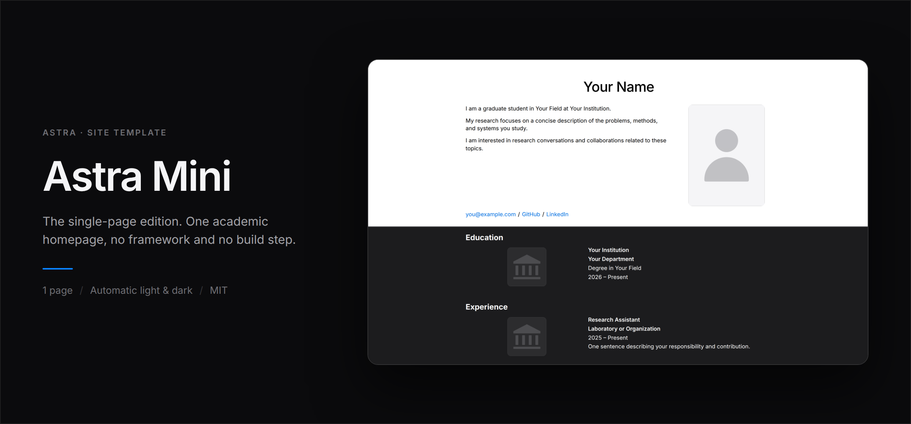
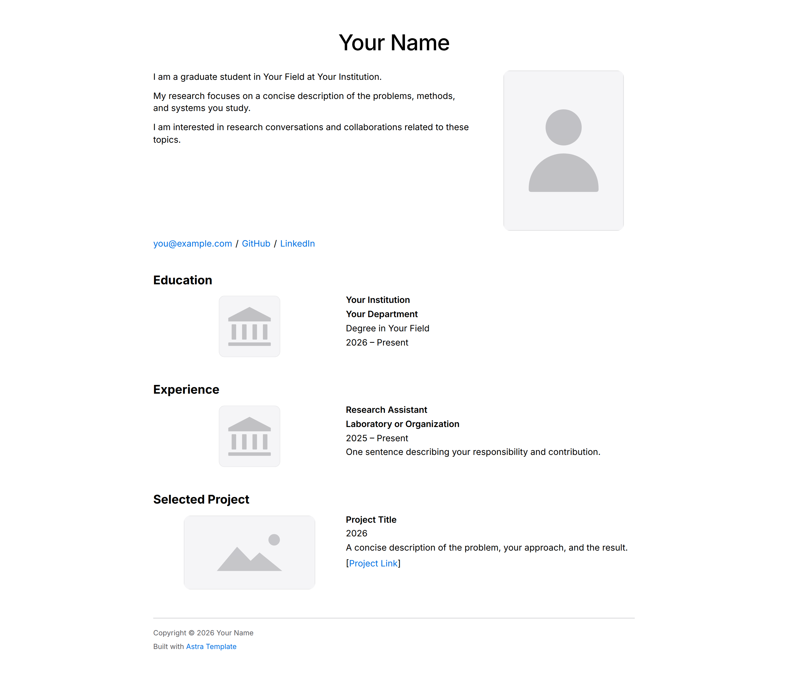
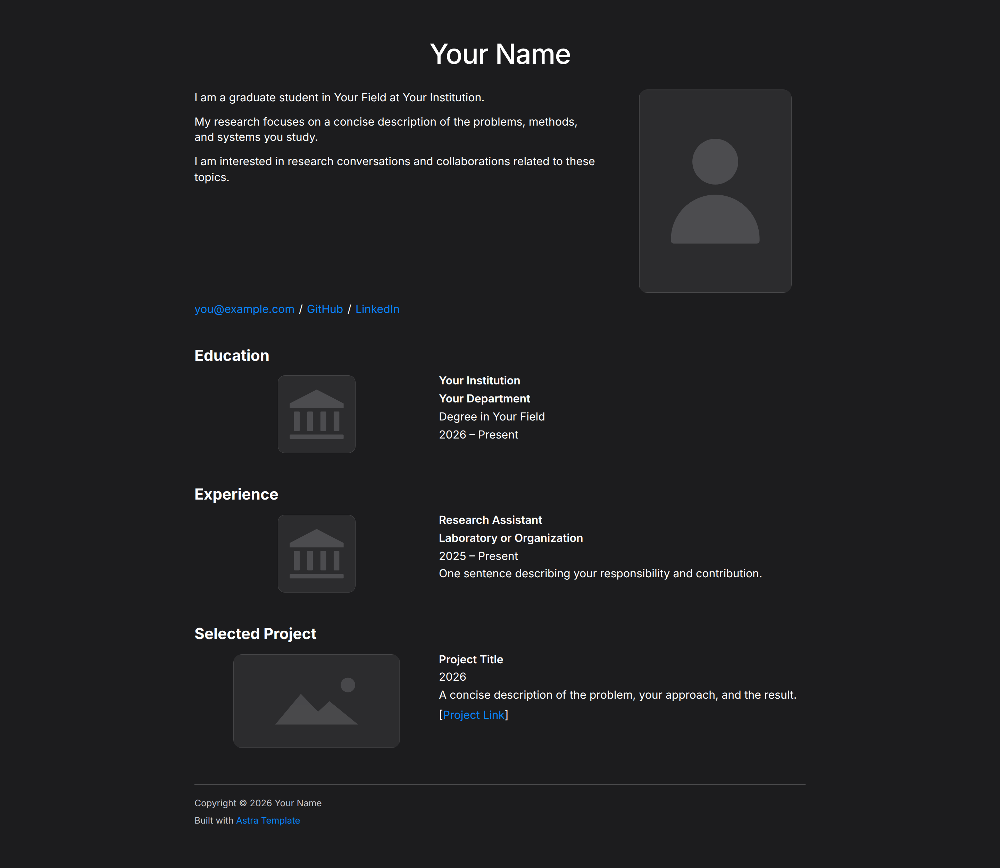

# Astra Mini



The single-page edition of **Astra: Adaptive Site Template for Research and
Academia** — one HTML file, one stylesheet, thirteen lines of JavaScript, and an
academic homepage that looks finished.

No framework. No build step. No configuration file. Nothing to keep up to date.
Edit `index.html`, push it anywhere that serves static files, and you have a
site.

## Contents

- [Editions](#editions) · [Screenshots](#screenshots) · [What is on the page](#what-is-on-the-page)
- [Running it](#running-it) · [Deploying](#deploying)
- [Editing](#editing) · [Theme](#theme) · [Structure](#structure)
- [Regenerating the images](#regenerating-the-images) · [License](#license)

## Editions

Astra comes in three sizes. They share one visual system — the same type scale,
spacing, colours and responsive rules — so a site can move up an edition without
being redesigned.

| | **Mini** | [Lite](https://github.com/yixnhuang/astra-lite) | [Full](https://github.com/yixnhuang/astra-full) |
|---|---|---|---|
| Pages | **1** | 4 | 17 |
| Navigation | **none** | shared bar | shared bar with grouped dropdowns |
| Theme | **follows the OS** | follows the OS | follows the OS, plus a visitor control |
| Footer | **inline** | shared fragment | shared fragment |
| Project documentation | — | — | six formats |
| Blog and RSS | — | — | yes |
| Discovery files | — | — | robots, sitemap, llms.txt, humans.txt |
| Repository | **public** | public | private |
| License | **CC BY-NC-SA 4.0** | CC BY-NC-SA 4.0 | non-commercial |

All three carry the same licence. Mini is the one to start from.

## Screenshots

Rendered from this repository with no content changes: Chromium, 1440 px
viewport, `deviceScaleFactor` 2, full page. Both captures use the same
unmodified sample content; only the colour-scheme preference differs.

| Light | Dark |
|---|---|
| [](docs/screenshots/home-light.png) | [](docs/screenshots/home-dark.png) |

The banner at the top is not a montage of two crops: it is one continuous page
split by a horizontal seam, light above and dark below, at the same scroll
position. See [Regenerating the images](#regenerating-the-images).

## What is on the page

One scroll, in this order:

1. **Profile** (`#bio`) — name, one-line affiliation, a short bio, a portrait,
   and a row of links.
2. **Education** (`#education`) — institution, department, degree and dates,
   each with a square logo slot.
3. **Experience** (`#experience`) — role, organisation and dates, same logo slot.
4. **Selected Projects** (`#projects`) — title, one-line description, a 16:9
   thumbnail and a link.
5. **Footer** — written straight into the page. Unlike the larger editions there
   is no fragment to fetch and no loader script.

Every section is plain HTML in `index.html`. Removing one is deleting a block;
there is no template language in the way.

## Running it

```bash
git clone https://github.com/yixnhuang/astra-mini.git
cd astra-mini
python -m http.server 8000
```

Then open <http://localhost:8000>.

The local server is required. Mini fetches nothing at runtime — the footer is
written into the page rather than loaded — but its stylesheet, script and images
are referenced with root-absolute paths (`/assets/css/style.css`), so opening
`index.html` from the filesystem gives an unstyled page.

## Deploying

Any static host: GitHub Pages, Cloudflare Pages, Netlify, or a directory behind
nginx.

**One constraint.** `index.html` references its assets with root-absolute paths
(`/assets/css/style.css`), so the site has to be served **at a domain root** —
`example.com`, or a GitHub Pages site with a custom domain. Deploying to a
project subpath such as `username.github.io/astra-mini/` will serve the HTML
without its stylesheet. Serve it at a root, or change the four `/assets/…`
references in `index.html` to relative paths, which for a single-page site is a
one-minute edit.

## Editing

| To change | Edit |
|---|---|
| Everything on the page | `index.html` |
| Colours, type, spacing | `assets/css/style.css` |
| Breakpoint behaviour | `assets/css/responsive.css` |
| Portrait | `assets/images/portrait.svg` |
| Institution logos | `assets/images/institution.svg` |
| Project thumbnails | `assets/images/project.svg` |

The three SVGs are neutral placeholders. They exist so the layout reads
correctly before you have your own images — replace them with real files of the
same aspect ratio (portrait 3:4, institution 1:1, project 16:9) and nothing
shifts.

## Theme

Astra Mini follows `prefers-color-scheme` and shows no theme control: the
visitor's own setting decides, and there is nothing to click.
`assets/js/theme.js` is twelve lines and listens for changes, so switching the
OS to dark mode switches the page immediately.

Colours live as custom properties on `:root` in `style.css`, with the dark set
redefined under `:root[data-theme="dark"]`. Changing the accent means changing
two values, not hunting through the file.

## Structure

```text
.
├── index.html              the whole site
├── assets/
│   ├── css/
│   │   ├── style.css       the visual system
│   │   └── responsive.css  breakpoint behaviour
│   ├── js/
│   │   └── theme.js        follows the OS colour scheme
│   └── images/
│       ├── portrait.svg
│       ├── institution.svg
│       └── project.svg
├── docs/
│   ├── screenshots/        the README images and capture.py
│   └── brand/              showcase cards
├── LICENSE
└── README.md
```

## Regenerating the images

```bash
pip install playwright pillow numpy
playwright install chromium
python docs/screenshots/capture.py
```

The script serves the repository, loads the homepage under both colour-scheme
preferences, and writes `home-light.png`, `home-dark.png` and `hero.png`. The
banner's seam position and window height are not hard-coded: the script measures
the captured page, finds the blank gaps between sections, and puts both the seam
and the bottom edge at the **centre** of a gap, so neither ever cuts through a
line of text. Change the content and the numbers follow.

See [`docs/screenshots/README.md`](docs/screenshots/README.md) for the details
and [`docs/brand/README.md`](docs/brand/README.md) for the showcase cards.

## Project status

Maintained. Astra Mini is the public single-page edition of Astra.

## License

Astra is distributed under
[CC BY-NC-SA 4.0](https://creativecommons.org/licenses/by-nc-sa/4.0/) — see
[`LICENSE`](LICENSE) for the full terms. Non-commercial, so it is
source-available rather than open source.

In short:

- **You may** use Astra to build your own academic homepage, edit any of the
  content, publish the resulting site, and pass the template on.
- **You must** keep the attribution. The footer of every page carries
  `Built with Astra Template`; that line, and the notices in the source files,
  stay.
- **You must** release any template you derive from Astra under the same
  licence.
- **You may not** use it commercially: no selling it, no template marketplace,
  no paid web-design service built on it.

Building your own site with it is personal use, not commercial use, even if the
site belongs to a company you work for. Commercial use is available on request
— see [Contact](#contact).

## Contact

- Website: [yixuanhuang.com](https://yixuanhuang.com)
- Email: [yixhuang@umich.edu](mailto:yixhuang@umich.edu)
